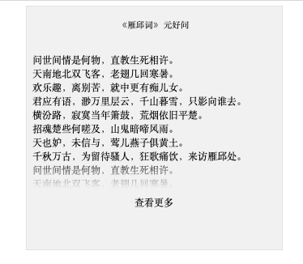

# Some Useful css styles

## 1. Check-more

[Demo and Source Code on CodePen](https://codepen.io/jerenyaoyelu/pen/WNrmMNa)

## 2. Highlight tag and blur background by clicking

---------------------------------------------------------------------------------------
> Open and Free By Yaoye(Jeren) Lu
> Welcome to join me and make contribute to this repo