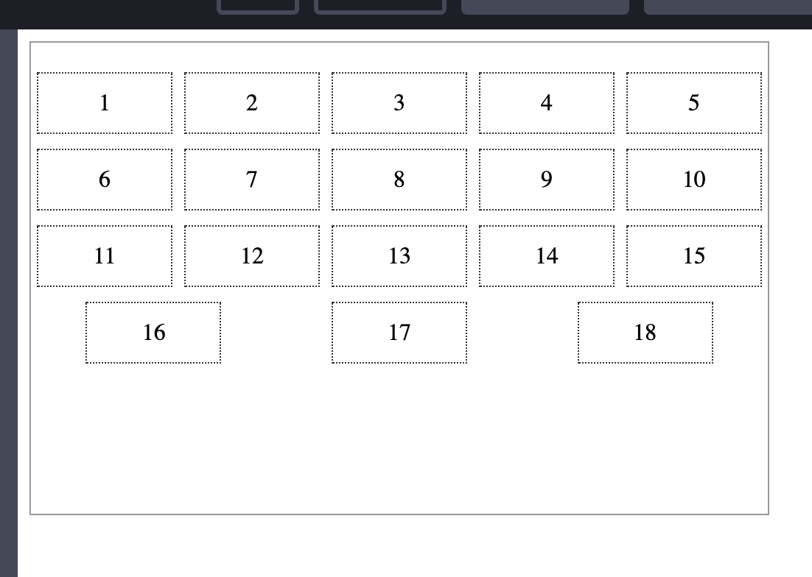

# Some Useful css styles
> Based On [Vue](https://github.com/vuejs/vue)

## 1. Check-more

[Demo and Source Code on CodePen](https://codepen.io/jerenyaoyelu/pen/WNrmMNa)

## 2. Highlight tag and blur background by clicking

[Demo and Source Code on CodePen](https://codepen.io/jerenyaoyelu/pen/yLewvEN)

---------------------------------------------------------------------------------------
> Open and Free By Yaoye(Jeren) Lu

> Welcome to join me and make contributions to this repo